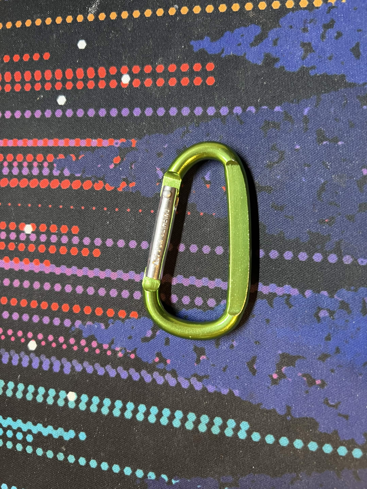
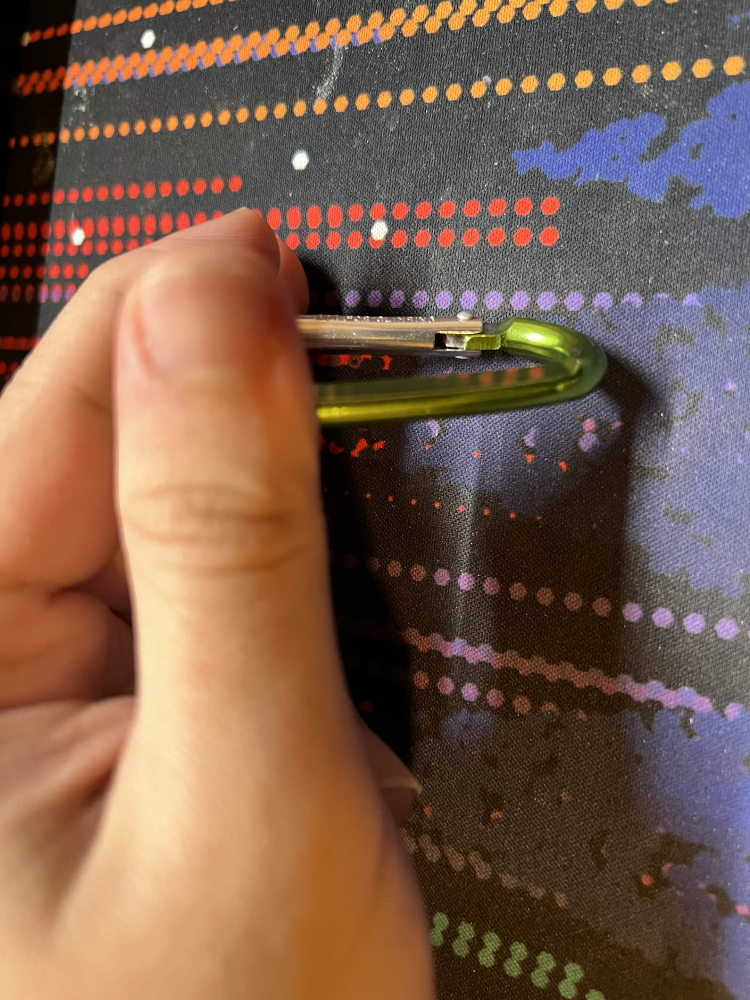
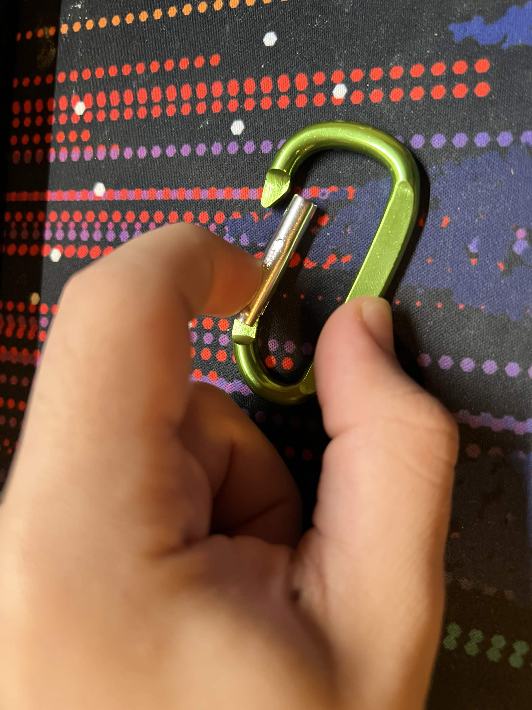

# A1 – Create A Portfolio

## Objective
To create a a place that holds all the assignments for MEGR-2157, while also being professional and easy to navigate.

## Analyze
### Portfolio 1 - https://uncc.instructure.com/eportfolios/3686/A1_About_Me
The first portfolio I choose was Jake Kudia from 2024 Spring. Off the bat all his assignments and documents are linked on the side of the page making it very accessible for any and everybody. As for reproducibility, each assignment contains plenty of information for others to recreate or reproduce something from here if needed. He would even go above the standard and include extra pictures of himself and his work to further help get his ideas and goals across. Along with this all his ideas and decisions have a strong basis of evidence or how he came to that conclusion, an example would be why he wanted to become an engineer going on to state "From a young age I was always fascinated on how things worked," later leading him down to studying engineering. The tone and wording of the assignments and documents in his portfolio can be quite wordy and lengthy, however by using these extra words every decision or action taken is explained in great detail. This leads me to say that his portfolio is professional, especially in work environments that require extra levels of communication and reasoning.
### Portfolio 2 - https://nhoong.github.io/index.html
This is the second portfolio I will be analyzing and it is from Nathan Hoong and it is hosted on github. Firstly all his projects are neatly listed on the main page which many images and descriptions of each, this allows one to easily locate a single project or work he has done. However it should be noted his wobbler engine video cannot be displayed. While each project is quite accessible and has plenty of images, there isn't much of a description on each (excluding his senior capstone) making it quite difficult for one to reproduce a project without contracting Nathan Hoong directly. What is quite nice is that under each project an objective and result is given, however each decision made and the reasoning stated behind it isn't. While missing many explanations the wording and design of this portfolio is quite professional, as for the missing details if an employer needed them his contacts are clearly stated and are given a few options on how to contact him.

### Product Analysis - Self-Closing Carabiner - https://patents.google.com/patent/US5005266A/en
A. - The primary function of a Carabiner is to hold or link two or more objects together while allow for slack or play between the objects. A main objective for this product is easy of use and how quickly two objects can be "linked" together.

B i. - One of the main functions of this Carabiner in particular is that it is self closing, as the tasks it was designed for requires that it can be used by a single hand or by someone with low dexterity. In self-closing carabiners use a spring hidden inside of the arm or "tongue" (as stated in the patent) to create a force closing the arm close. The amount of force to overcome this can be described by this equation. 

Fspring=k*Δx

Where F is the force of the spring pushing the arm into the close position, K is the spring constant and Δx is how far the arm has been opened. Alternatively some self-closing carabiners use a torsion spring rather than coil spring, this can be explained by this equation.

Fspring = (κθ)/r

Where F is the force of the spring pushing the arm into the close position at radius r, κ is the torsion spring constant, θ is the angle of deflection, and r is the radius from the spring. 

B ii. - Assumptions made for both equations is that there are no outside forces, such as gravity, acting on the system, and have no losses due to things like friction. In the torsion spring equation it is also assumed that you are pushing along the arm at a perfect 90 degrees.

C. 
The main body of the carabiner. It is shaped like a C so the arm has a place to open up on the side, along with this the shape of it allows it to put more of the load on the strong side rather than the weak side with the arm that can pivot.

While the actual coil spring it's self it hidden away inside of the arm, the place where it attaches to the body is visible. It shows how as you bend the arm downwards it causes the spring inside to compress creating a force pushing it close.

This third image shows how the arm slots in and "locks" with the main body. A piece of metal sticks out from the main body to stop the arm from going out further than the main body itself.

Two alternative solutions could be just a C clip as it limits complexity and failure points, another alternative could a locking carabiner as it provides a way to lock things from getting in or out of the clip. However in this patent they describe a use case that requires the use of this product to be quick and efficient which is why I believe they left out the locking mechanism found on most carabiners as it provides a hinderance to many people looking for a quick and easy way to clip a few items together.

## Decide
 - Since a the homepages main objective is to be a place that can be easily navigated and lead to everything else it must be kept short and concise. Along with this it may provide a brief description of what may be contained in the portfolio along with any general tips or comments. As this is intended for a course that is being currently taken, many things that would be put into a homepage such as what to expect, how it's formatted, etc. has yet to be filled in. Due to this all I have left is the course description and what is planned to be put into the portfolio.
 - One element I have intentionally changed would be the color of the banner at the top of the page. Due to how light the green was it blended into the white page and didn't stand out, due to this I changed it to the UNCC green which is much darker and represent the institution I am currently attending. Along with this I also changed the logo to the UNCC crown logo.
 - The standard I hold myself to is to get everything done in a timely manner, while also keeping the language, designs and accessibility professional while still being understandable and functional. I will also commit to explaining my thought process and decision making quite thoroughly as to not leave any unknown or gray areas.

## Communicate
Completed in About Me.
