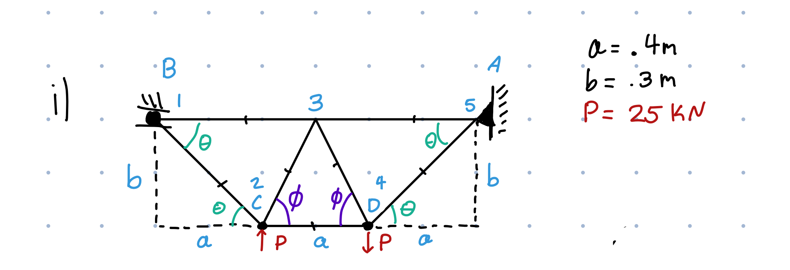
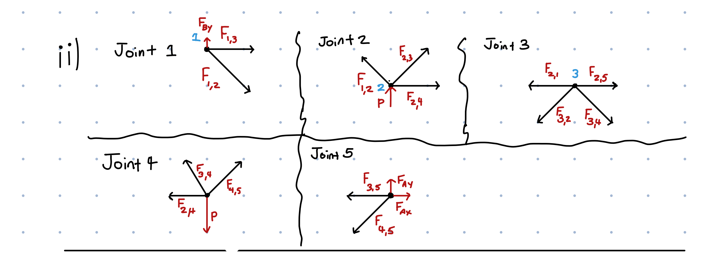
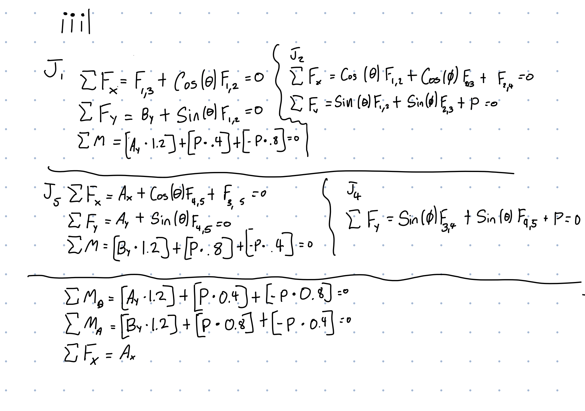
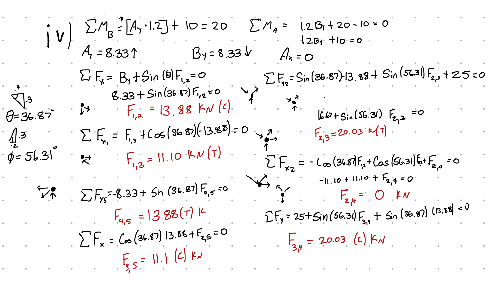
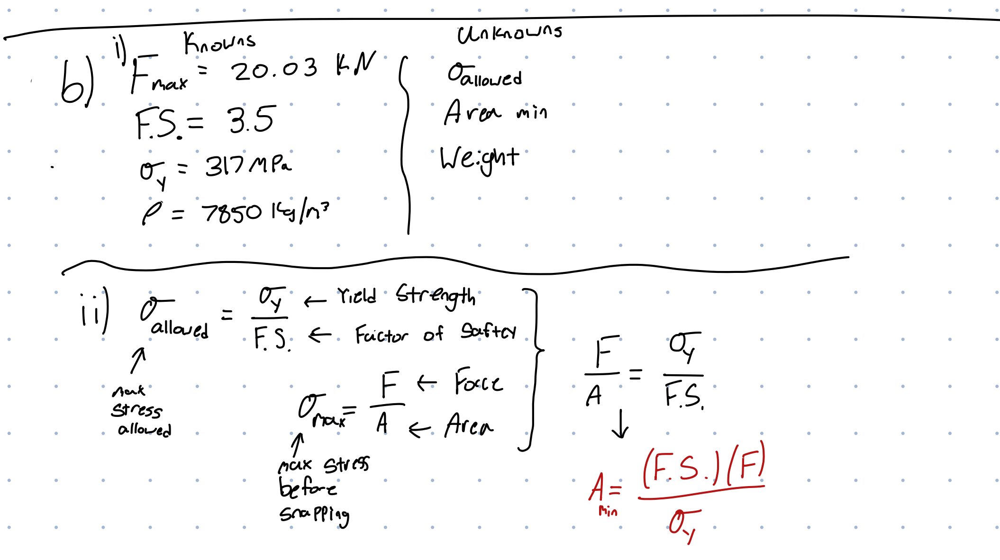
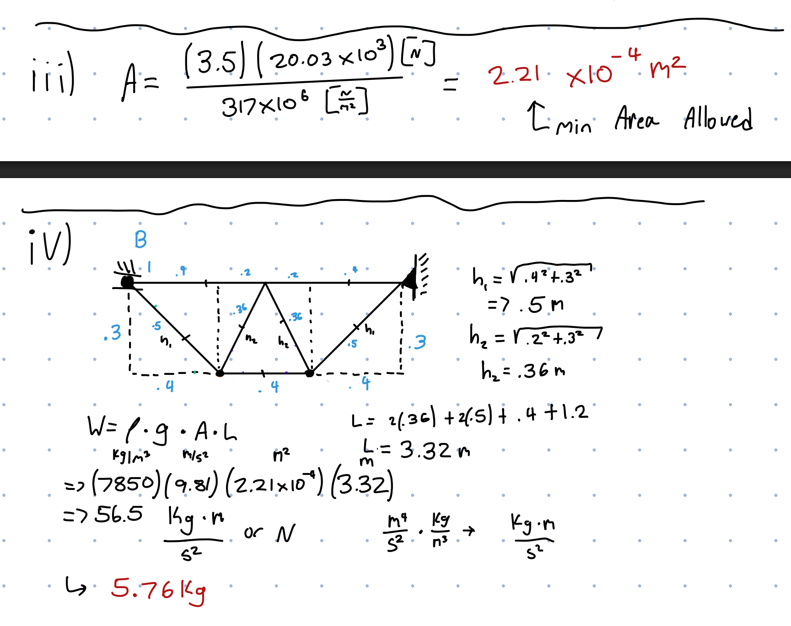
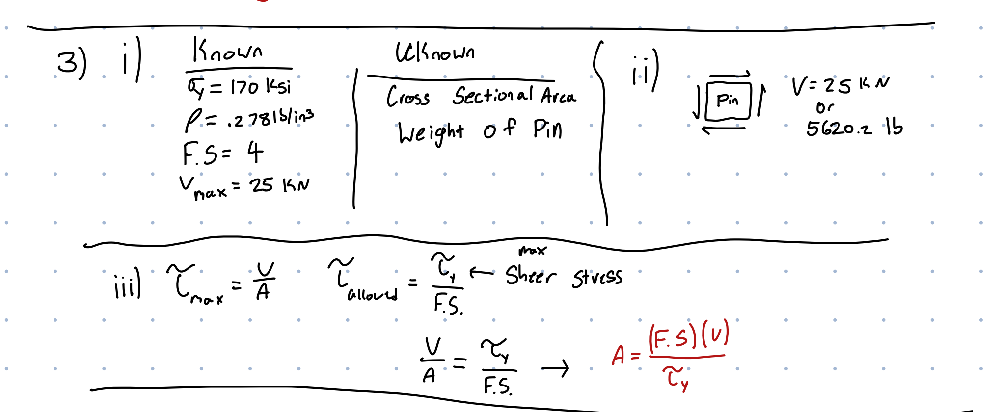

# A2 – Truss Stress Analysis

## Objective
-Design a truss using A500 steel
-Create free body diagrams
-Determine pin sizes based on shear forces with a safety factor.
-Solve equations symbolically and numerically for both truss and pin design.
-Estimate the total weight of the truss and pins.
-Create a CAD model with accurate dimensions and connections.
-Compare CAD weight predictions with hand calculations.
The main goal is design and create a truss that fits the given scenario, along with creating the truss we also want to make it as light as possible. Point A is pin support and Point B is a roller support, the P values I choose was 25 kN. When modeling in solidworks I created a custom material that fit the specifications of A500 steel.
## Decide
 
The first step was to design a truss for this situation, since we were instructed to keep it as simple as possible, along with keeping weight down, I choose a simple planar truss. This achieves both goals as it uses the least amount of members and joints (7 members and 5 joints) keeping weight down and leaving the design to be quite easy on the eyes. It is also still quite strong as all the shapes are triangles, which are the strongest shape. I labeled the dimensions using the variables given and added a legend to the side. Note I labeled each point with a corresponding number that will be refrenced later.
## Analyze
### Joints of the Truss

Firstly we must analyze each joint of the truss to figure out how the forces and internal forces act upon one another. Note every force that acts on a join is labeled in red, whereas each member itself is black.

Secondly we were instructed to solve for each join symbolically so that is what I have done here.

Finally we were instructed to numerically solve for each member and there forces. To find Ay, Ax, and By I calculated the total moment of the truss as a whole at points A and B. I would then go on to use these values to solve the rest of the forces in each member. Note: my calculations for θ and	Φ on the left side.
### Calculating Cross Sectional Area and Yield Strength of The Truss

To start off, I listed the known and unknow values of the problem. This allows me to quickly know what I need to solve for along with any values I am missing. Along with this it acts as a table for me to easily reference when doing calculations solving for the minimum cross-sectional area needed and the weight of the truss. (Note: I used the highest internal member force in the truss for all my calculations onwards) Then I combined the max sheer stress and max allowed sheer stress formulas together to create a formula that includes all the variables we need, along with the factor of safety requirement, as stated above. I would then do some algebraic manipulation to achieve the formula:
Amin=(F.S*Fmax)/σyield
Where F.S is the factor of safety, Fmax is the max force in the truss, and σyield is the max yield strength of A500 Steel.

Next I would numerically solve for the area, reaching the answer of 2.21x10-4m2. I would then use this area to estimate the weight of the truss (without pins) using the formula:
W=ρ*g*A*L
Where,	ρ is the density of A500 Steel, g is the gravitational constant, A is the cross-sectional area and L is the sum of all the beams. This would give me the estimated weight of 5.76 KG. 
### Calculating Cross Sectional Area of The Connecting Pins

Again, I would start off with listing the known and unknown values of the problem, knowing these values I can then create a stress element/ free-body diagram of the sheer forces acting on the pin. Creating this stress element allows a quick and easy way of depicting the sheer forces acting on the pin. I again would combine the max sheer stress and max allowed sheer stress formulas to create a formula that has all the variables we need, along with the factor of safety requirement. I again manipulated the formula to achieve:
A=(F.S*V)/τyield
Where F.S is the factor of safety, V is the max sheer force, τyield is the max yield strength of hardened tool steel.

I would finally solve for the cross-sectional area achieving a minimum area of 0.13224in2, I would solve for the weight of the 5 pins using the formula:
W=ρ*g*A*L
Where I would get a weight of .02591 lbf per pin or a total of .13455 lb for all 5 pins.
## Communicate
