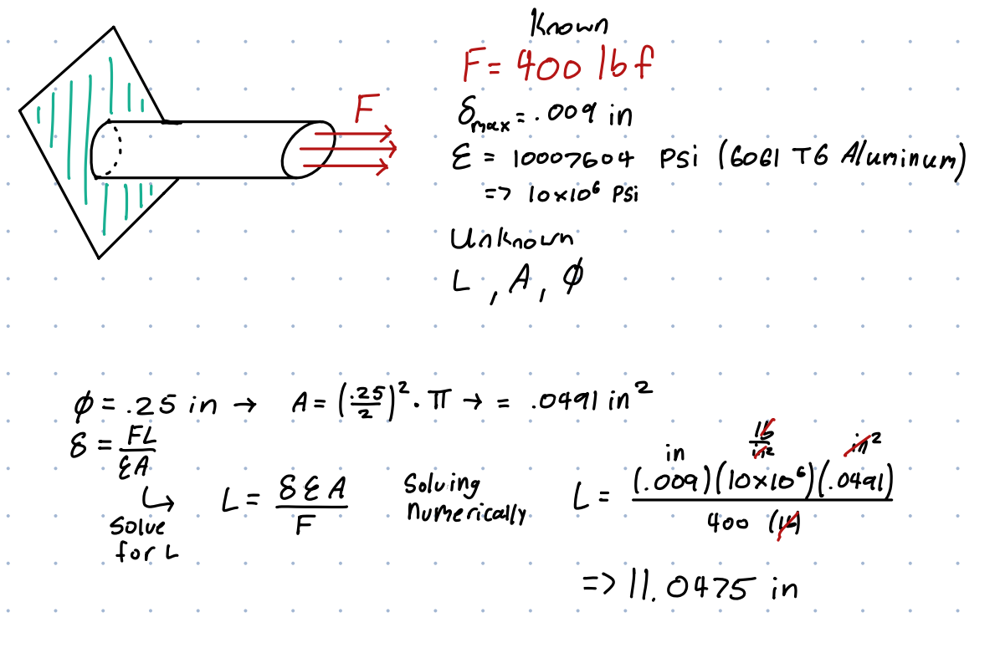
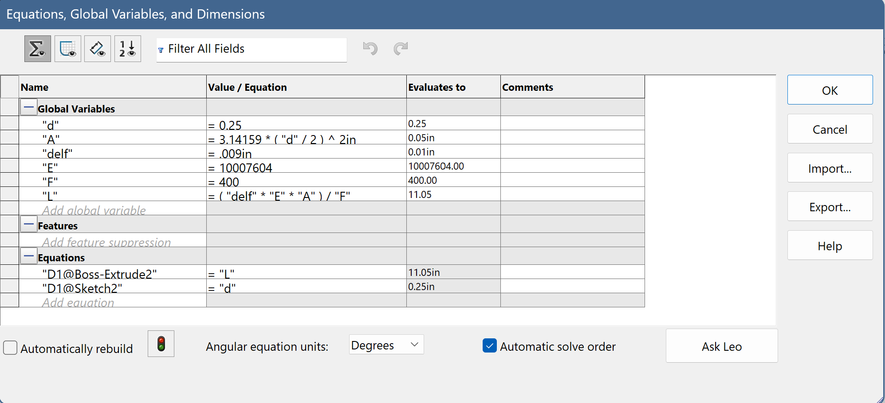
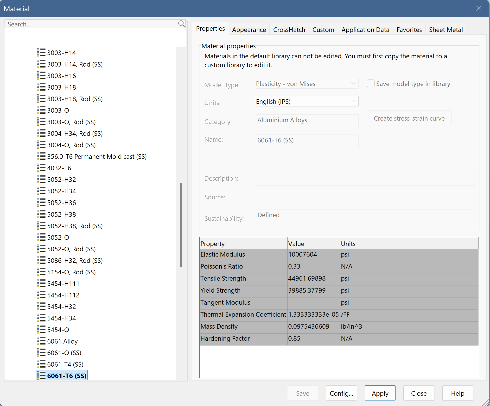
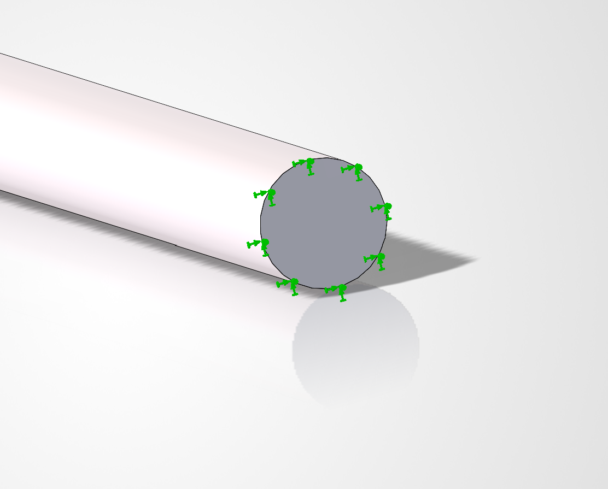
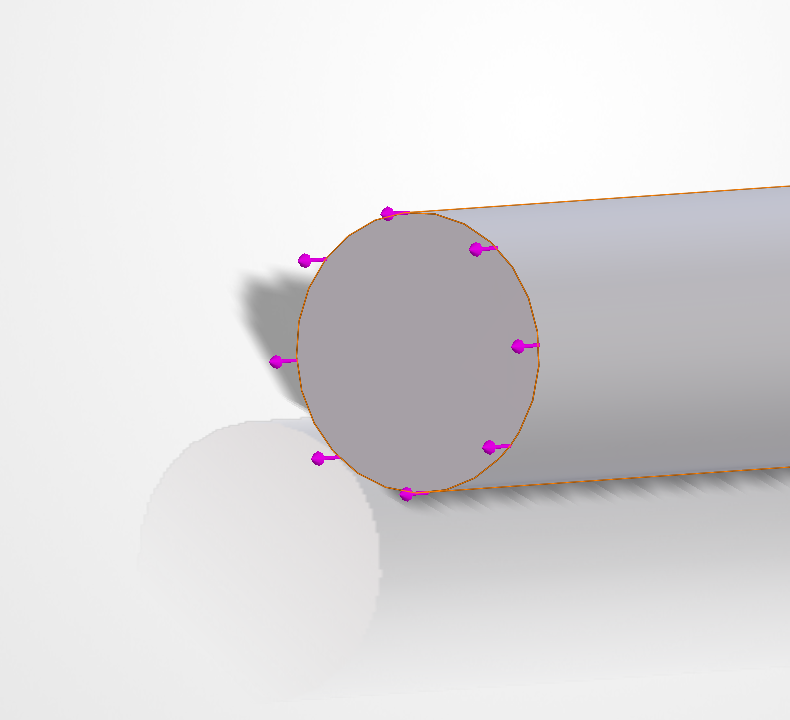
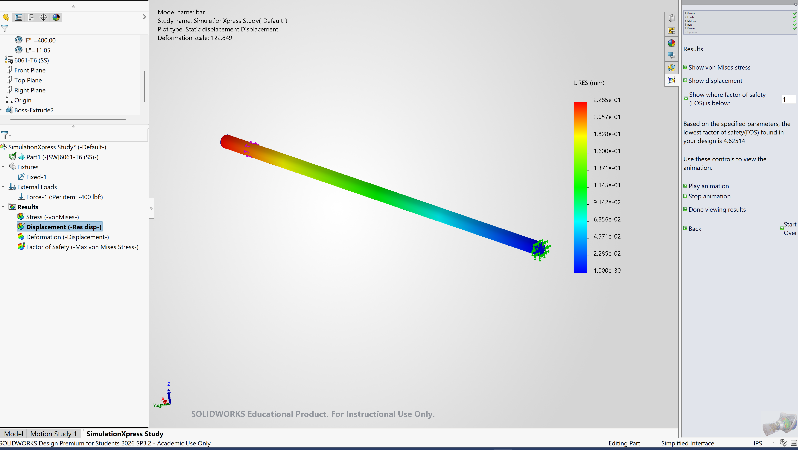
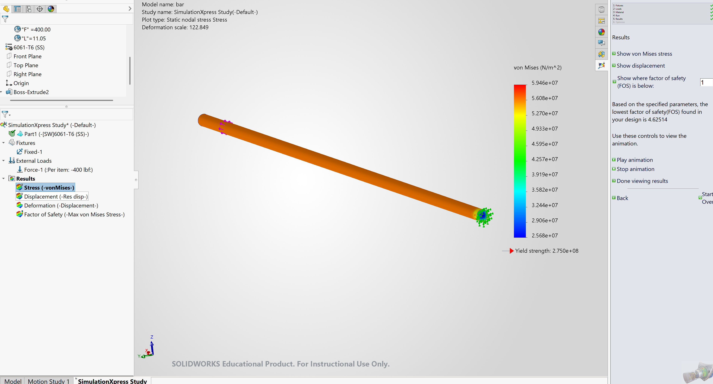
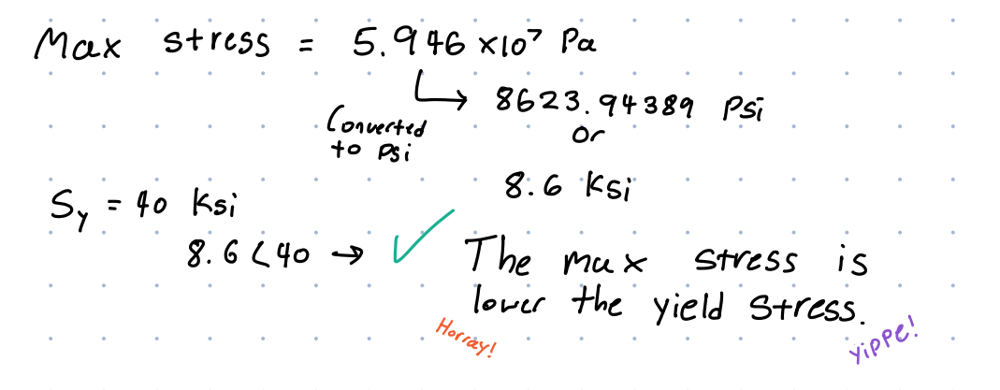
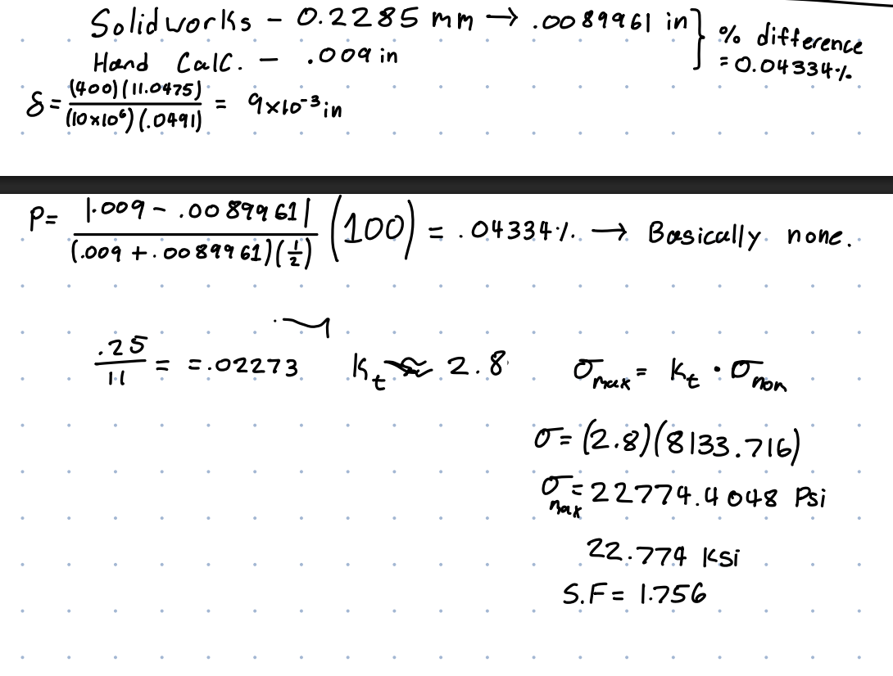
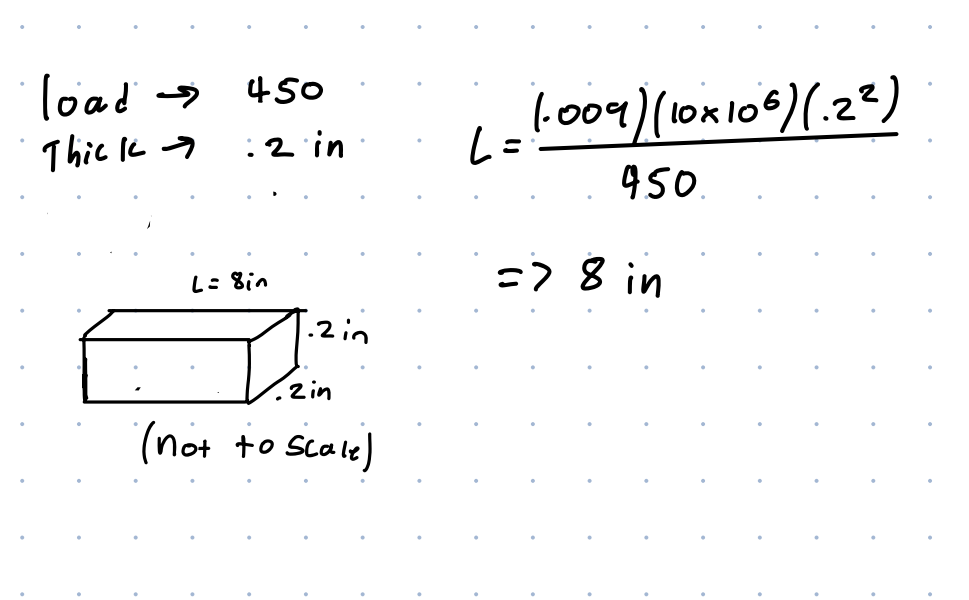

# A3 – Parametric and FEA

## Objective
To design an calculate a bar based on certain values given, then confirm calculations in a parametric CAD software such as solidworks, using finite element analysis. The main goal was to minimize values such as thickness and length, while keeping to a max deformation of .009 inches. Part of the design was choosing an appropriate material for the bar to made up of for the application specified.

## Design

Firstly I choose a force of 400 lb as it was in-between the two force values that were allowed, I then choose an arbitrary diameter of .25 in. But later in my calculations I found out this left with a bar of approximately 11 inches which isn't unrealistically long or short for the force applied. As for the material I chose 6061 T6 Aluminum alloy as it fit many of the properties needed for this type of application, such as an high Young's modulus. My calculations are shown below.

On the left I drew a diagram of where the bar would be attached, and the force applied, along with where. I also stated all the known and unknown values that I needed to solve for. Note, since I haven't yet chosen diameter, the area is also unknown, but I would just pick .25 in for the diameter as it sounded nice in my head. Using the diameter I would then solve for the area. Using the deformation equation I would rearrange it to find length, L, as that is our last unknown. After rearranging, and solving it numerically I would end up with a length of approximately of 11.0475 inches.

Here all the dimensions and equations imported into solidworks, this gives us an easy spot to change a certain dimension such as diameter and how it will effect other values such as the total length.

Here are the properties of 6061 T1 aluminum, these are the source of the values used in both my hand calculations and calculations done in solidworks.

## FEA in Solidworks

To create the FEA in solidworks firstly I had to add a fixture and a point where the force is acting upon the bar.

Here is where I attached the bar to a rigid fixture.

This is the other end of the bar where the force will be acting upon the axis of the bar.
Afterwards I generated a deflection map, this will show how much the bar will deform.

This is the von Mises Stress map, showing where stress is the highest and lowest.

Using the values provided in solidworks I calculated that the max stress in the bar is lower than the yield strength of aluminum (40 ksi). I also calculated the safety factor to be 4.62514. My calculations are shown below.

 
## Design Reflection

After performing some calculations the percent difference between my original hand calculations and the one done in solidworks is 0.04334%, which is within margin of error. This is to be expected as both calculations used the same values and the only difference would be how far is each intermediate step rounded. However I would use my own hand calculations as I know exactly where I rounded and each intermediate step, whereas we do not know the calculation process in solidworks. Below are my hand calculations for finding the percent difference.

Above are my calculations for finding the peak stress approximation for a pin with a diameter of .15 inches. I would derive Kt from a graph found on "Engineer's Edge." The Kt value I got was roughly 2.8, which I would go on to use to find my max stress of about 22.774 ksi. This would NOT pass my safety factor as it is about 1.756 which is too low for most applications, and is much lower than the saftey factor orginally found of 4.62514.

## Lesson learned
Mistakes I made was misplacing forces in solidworks as it was my first time using any FEA before, and miscalculating certain values due to plain incompetence. I spent roughly 4 hours on this assignment in total.

## Modify Design Parameters 
I would change the design from a circular cross section to a square one, with a width/base of .2 inches, along with upping the force from 400 to 450 lb. Doing this I would assume the bar would shrink because I upped the force while also decreasing the total area for the force to act upon. After doing the calculations (shown below) I would find my assumption to be true as the bar shrank from about 11 inches to 8 inches.

[Download CAD File](bar.SLDPRT)
 

