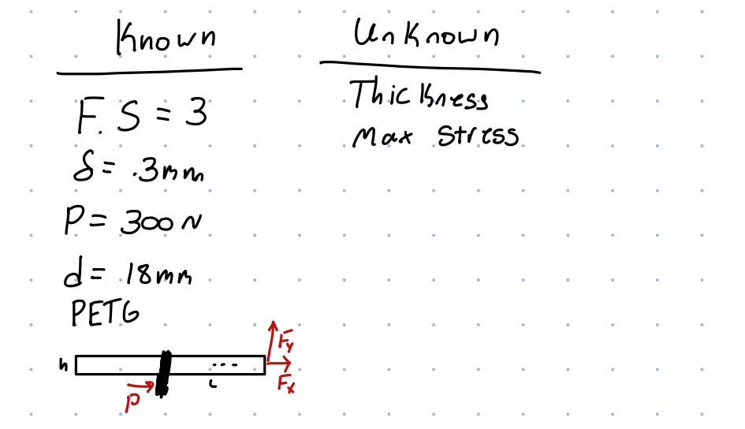
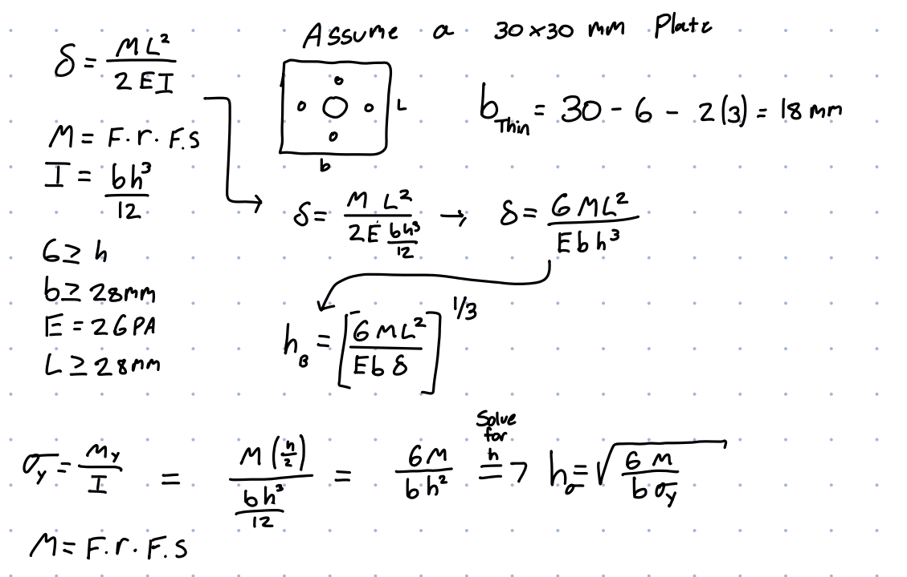
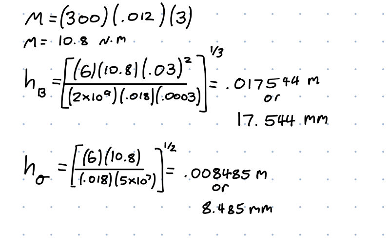
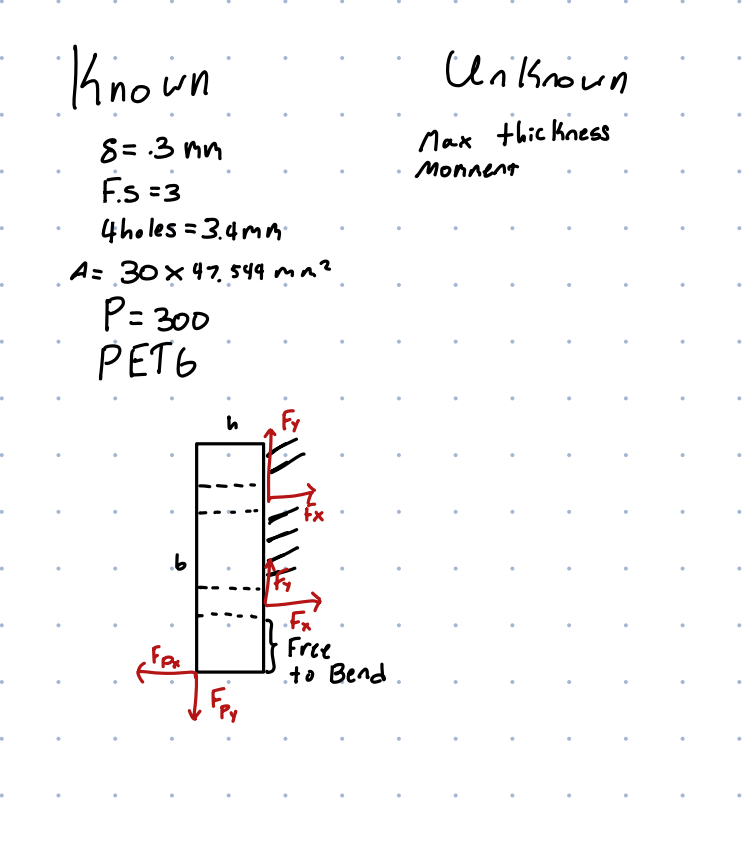
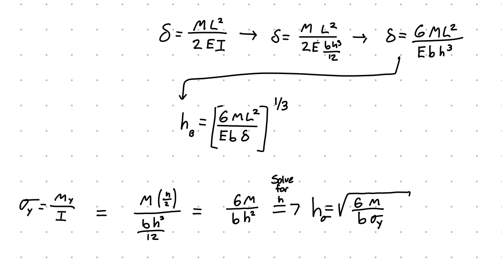
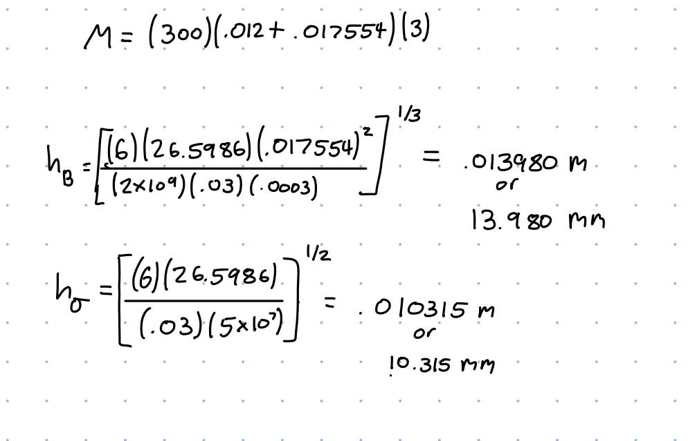
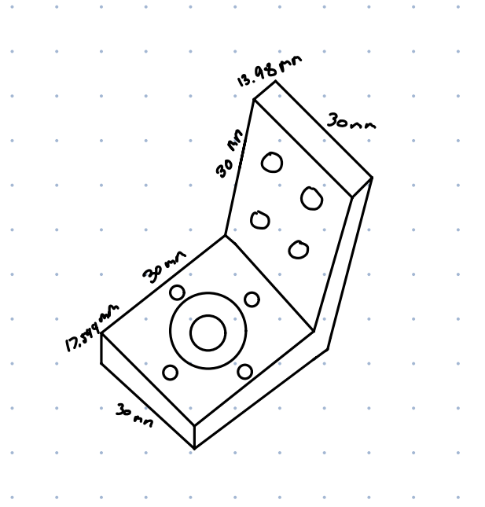

# A4 – Motor Mount

## Objective
The main objective is to design a motor mount that will attach to a rigid wall using 4 M3 bolts. For both features the dimensions were calculated using simple cantilever beam equations. The max deflection was .3mm, and a safety factor of 3 was used for all final calculations. The material I choose was PETG due to it's low cost and decent performance in these applications.

## Analyze

### Feature One

Firstly I would list the known and unknowns for the problem, finding that we must find the thickness of the feature. To find the thickness we would use two equations, one for the max deflection allowed and one for the max yield strength of the feature.

However before I did that I would also draw an FBD to get a better understanding of the problem.

After drawing an FBD I would solve for both equations symbolically, for max deflections the equation I  would use: 
del=(ML^2)/2EI 
Where M is the moment described by L * R * F.S, E is Young's modulus of PETG, and I is bh^3/12
After plugging in all the letters, I would do algebraic manipulation to find for h, which is just the thickness of the part. Secondly I would solve the max yield strength problem by using the formula sigma = (M*y)/I
Where sigma is the max yield strength, M is the moment, y is the distance from the neutral axis and I is the moment of inertia. I would then also manipulate this to find h. 

After solving symbolically I would then solve numerically. For the thickness needed to stay under max deflection is 17.544 mm and the thickness needed to stay under the yield strength is 8.485 mm.

### Feature Two

As for feature two, I would again start with listing out the knowns and unknowns of the problem, with then following it up with an FBD of the problem.

For feature two the same equations would be used as in feature one. Since they are the same many of the intermediate steps to find the equations for thickness has been skipped. But please note, some of the calculations for feature two are based upon calculations made on feature one, such as the thickness of feature one affecting the total length of feature two. 

What is not the same however, is the final numbers I have calculated. For optimizing the feature for max deflections I calculated a total thickness 13.98 mm. However when optimizing for yield strength I calculated a thickness of 10.315 mm. 
NOTE: When solving for this problem, the actual bending part is the same thickness as feature one. 

### Sketch 
Here is the isometric hand sketch I created, the lengths and size of the model is based upon the numbers I achived through my calculations.

### CAD Model
Below is what an isometric view of the model I designed in CAD based upon my formulas and calculations.

Here is all the equations and values used to create the model.

To go along with the CAD Model, this is the drawing of the model made in Solidworks.

## Communicate

An error I made initially was not accounting for the decreased width of the part due to the holes created to fit the motor and the screws needed to hold it in place. I would correct for this by removing the diameter from the total width of the feature.
Something I learned was the importance of modeling parametrically as it allowed me to make many changes the CAD model on the fly without needing to go back and changing each part value/dimension. 
Overall I spent about 6 hours doing this assignment.

## Appendix
Motor Mount sources - https://www.drivesandautomation.co.uk/useful-information/motor-mounting-codes/

