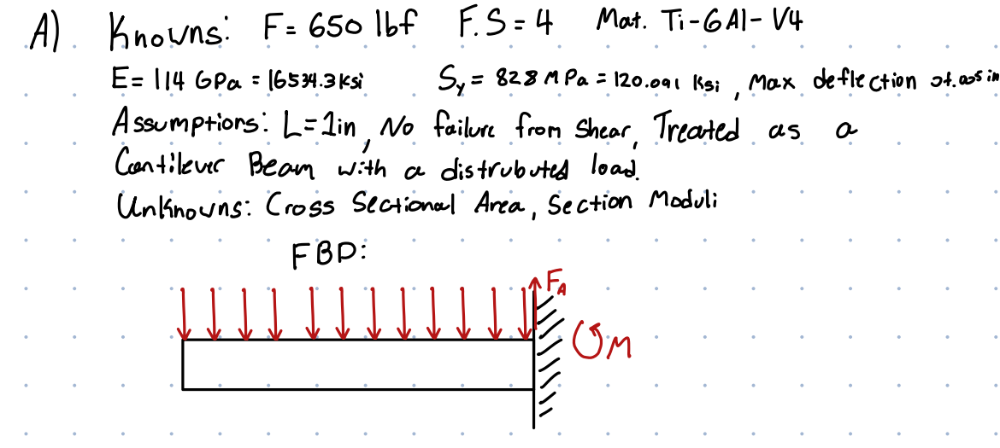
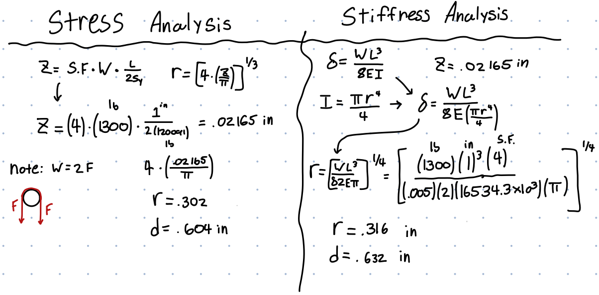
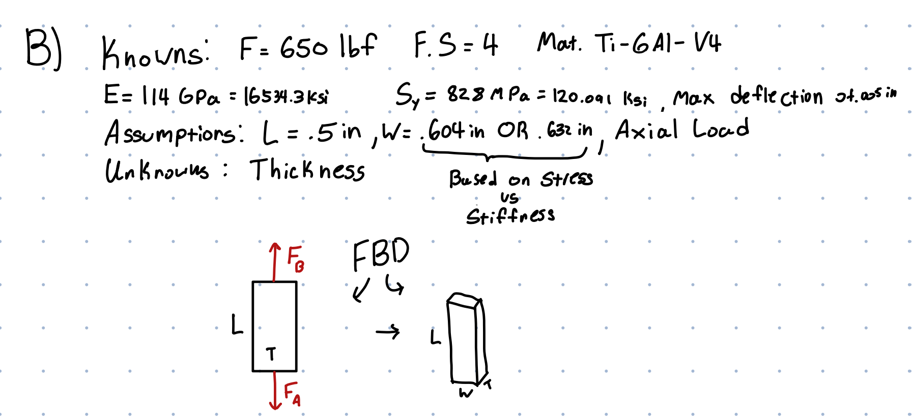

# A5 – Bracket Design and Analysis, Designing For Strength And Stiffness I, 
## Objective
Our main objective was to design, analyze and design a bracket that can safely support a load. The bracket was designed to hold a max load of 1300 lbs, distributed into a strap that evenly split the load into two equal forces. Each component was designed for strength or stiffness, whichever one was thicker was used in the final design. A safety factor of four was used for every calculation, and a max deflection/deformation of .005 inches was used. As for material choice I chose titanium (Ti-6Al-V4), due to it's high strength to weight ratio. (Even though weight isn't a factor I still considered it) I landed on a yield strength of 828 MPa and a Young's modulus of 114 GPa. 
## Feature A
Feature A is the large circular section at the bottom of the bracket, to calculate the stresses I treated it as a cantilever beam with an equal force acting along the whole of the beam. I would first state all the knowns (Material Properties, known values, ect) and the Unknowns (what we are trying to find), I would also state all the assumptions I made such as the length of the beam. I would then draw an FBD of the beam, as show below.

I choose a length of 1 inch as the strap chosen was 3/4 of an inch leaving some wiggle room for the strap. I would first calculate the section modulus as it's needed for both strength and stiffness calculations. Due to the force of 650 lbs acts twice on the beam, the total weight on the beam is 1300 lbs. Calculating for the thickness of the beam I got .604 inches when designing for strength and .632 inches for stiffness. Due to stiffness being bigger the minimum diameter of the beam is .632 inches. My calculations shown below:

## Feature B
Feature B is the bar that connects feature A to the whole of the bracket, to calculate the stresses it was treated as an axial member carrying the total combined load of 1300 lbs from the strap. I would first state all the knowns (Material Properties, known values, ect) and the Unknowns (what we are trying to find), I would also state all the assumptions I made such as the length of the bar. I would then draw an FBD of the bar, as show below.
!

After drawing the FDB I would go on to solve for the strength and stiffness. I would start off with σ = F/A, where I would replace A with the formula A = W*T, where W is the Width of the part and T is the thickness. After doing some algebraic manipulation and solving for the thickness I would get .0717 inches thick when solving for strength. As for stiffness I would solve using δ = (PL)/(AE), after substituting the known values and solving for thickness I would get .0498 inches thick when solving for stiffness. Due to strength being the larger number the minimum thickness of feature B is .0717 inches.
## Feature C
Feature C is the long Beam in the middle of the bracket, to solve for this I would treat it as simply supported beam. As for the load I assumed that the backet could be used upside down where the weight rests on this beam so I calculated for the max load of 1300 lbs. My drawings and calculations are shown below.

After solving for strength I got a thickness of .403 inches, however when solving for stiffness I got a thickness for .340 inches. Since strength is the larger number, the minimum thickness of feature C is .403 inches
## Feature D
Feature D is what connects features C and B to E, since the forces run along the center plane for feature D my calculations are based upon an axial load upon it. Due to symmetry the total force that acts upon on feature D is 650 lbs. My drawings are calculations are shown below.

After solving for strength I got a thickness of .0217 inches, however when solving for stiffness I got a thickness for .0471 inches. Since stiffness is the larger number, the minimum thickness of feature D is .0471 inches
## Feature E
Feature E is where all the force from the strap lays upon, however due to symmetry the total force is evenly distributed on two features halving the total weight from 1300 to 650 lbs. I treated feature E as the weight of strap is evenly distributed along the whole of bottom side of the part, along with this it only has a single connection point which is feature D. My drawings and Calculations are shown below.

After solving for strength I got a thickness of .255 inches, however when solving for stiffness I got a thickness for .361 inches. Since stiffness is the larger number, the minimum thickness of feature E is .361 inches
## Multiview Hand Drawing
To go along with my calculations is the final multiview sketch of the bracket with all the values I solved for filled in. Note: the first image is the when solving for strength and the second image is when solving for stiffness. These drawings do NOT take into the minimum values needed if the other type was found to be bigger.

# 2517 - Linkage and Fits
We were tasked with designing a linkage that can slide on and hold on to an equal amount of force used above, along with connecting to a separate feature with a diameter of an inch. Due to the force only acting on one point rather than two the total force is only 650 lbs making the bracket desgined above more than enough to meet these requirements. I would again design the linkage out of titanium, with a total length of 4 inches and a width of 2 inches.

My calculations are shown below, since the diameter is 2 inches and the second shaft is an inch I used the minimum diameter of 1 inch for all my calculations. Reaching that the minimum thickness is .126 inches.

 

## Communicate

