# A6 – Bracket Design and Drawing
-Generate a CAD part for the bracket using the dimensions calculated in A5

-Use parametric design for the dimensions

-Create a drawing for the bracket part
## CAD Bracket
Firstly I imported all the formulas and values I calculated in A5. By doing this all my part files are designed parametrically allowing for quick dimension changes if needed. Shown below are all the formula and values.
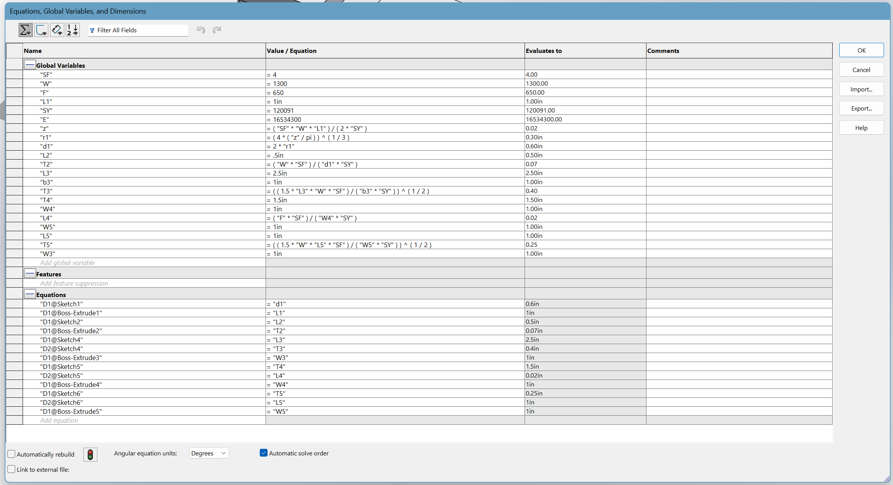
Here is the isometric view of my finalized bracket.
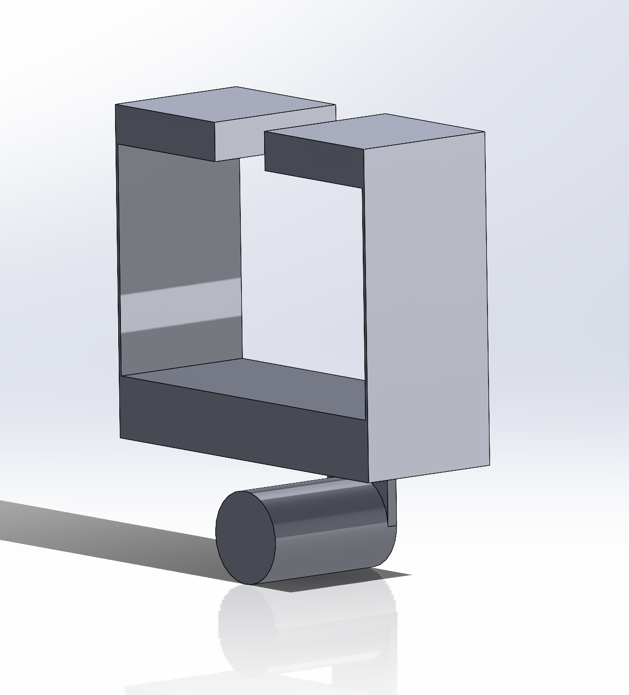
Here are the individual dimensions for each feature, starting at feature one.
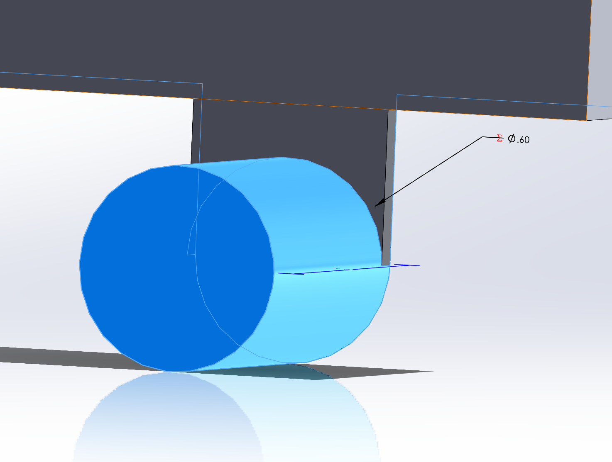
Feature 2
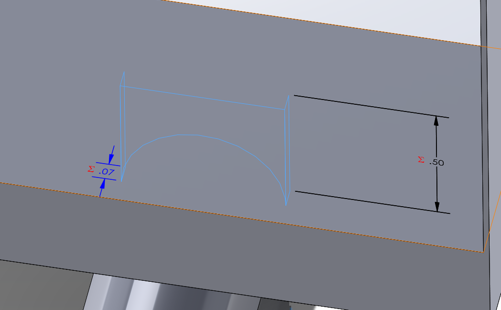
Feature 3
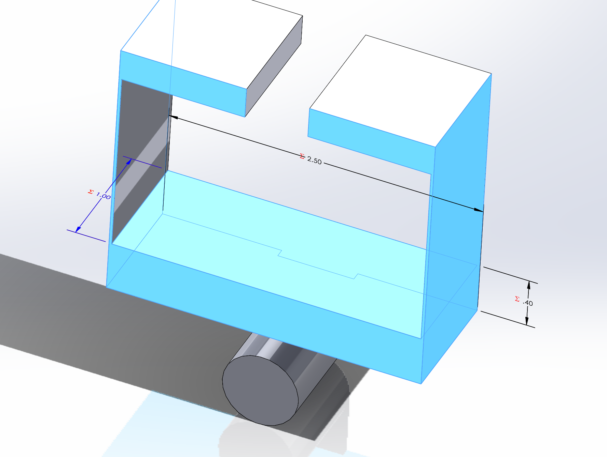
Feature 4
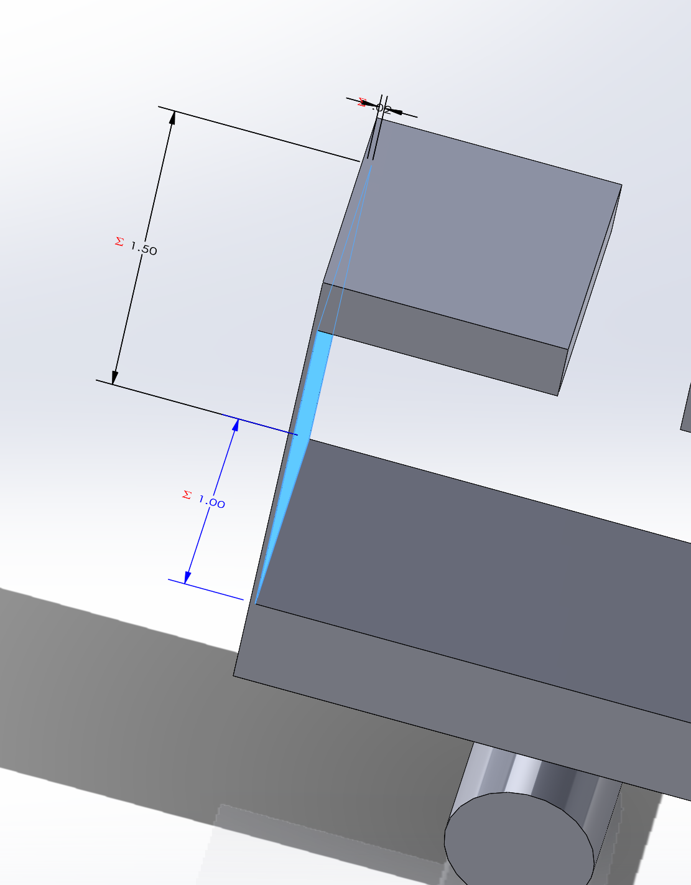
Feature 5
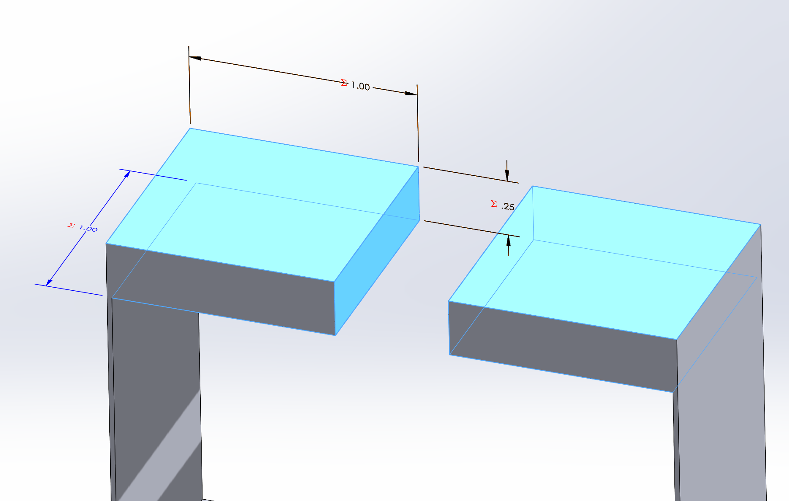
## CAD Bracket Drawing
Here is the drawing of the bracket, along with all the tolerances needed for the slip fits.
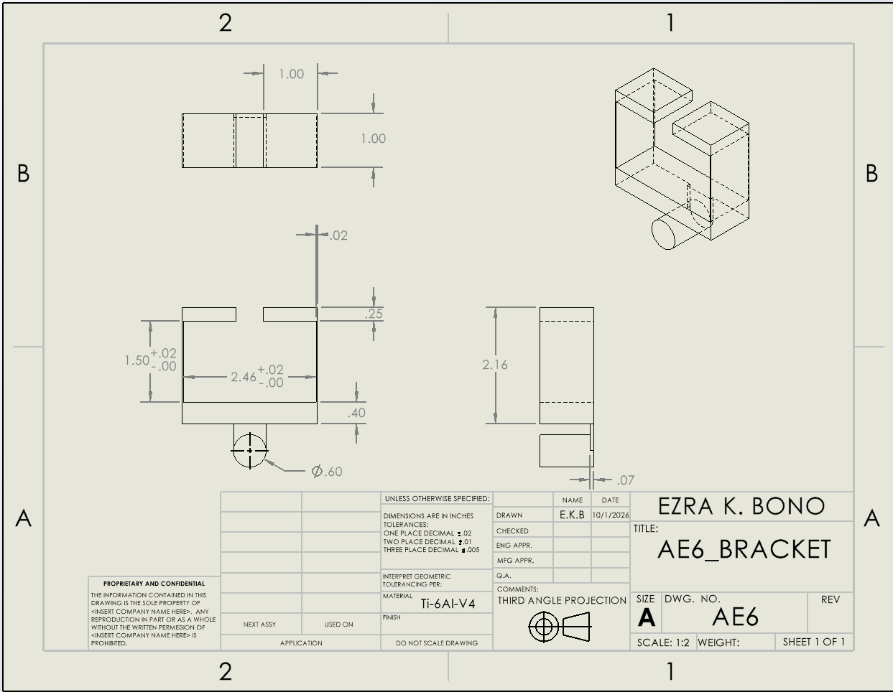
## Reflection
An analytical model used to drive a dimension would be my diameter for feature one. I expressed that equation using the one I used for my hand calculations, if I needed to change a value in it the diameter of feature one would also change accordingly. The rest of the model would too as all my equations use common variables and build upon one another.
A dimension I used a tighter tolerance for is the width of sliding fit as it is a mating surface that cannot have a lot of play between the belt and bracket. If I put this tolerance on the whole part, the cost of the part would skyrocket as now everything has to be super precise.
## Link
Again the first step was to import all the equations and values I calculated from A5, shown below.
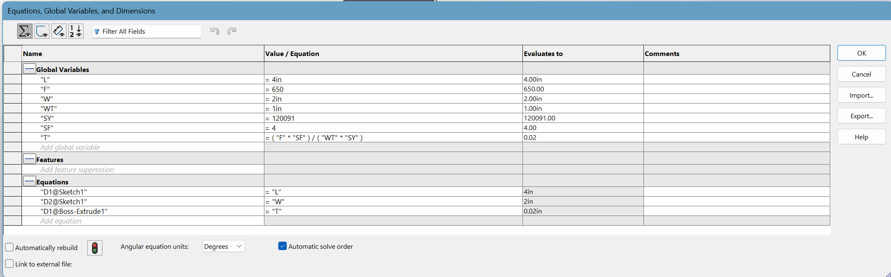
Here is an isometric view.
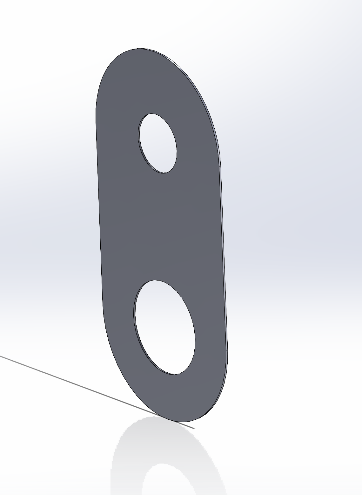
Here is the drawing of the part, with tolerances added.
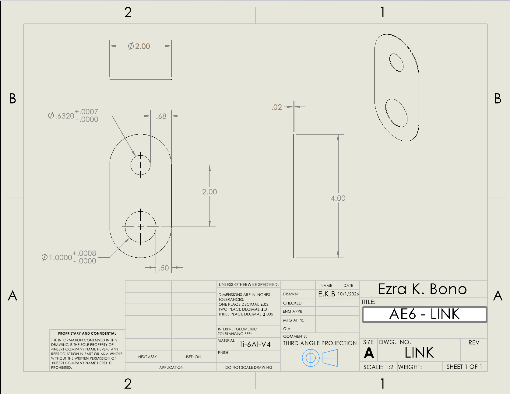
## Reflection
I learned about how tolerances can affect final cost of production along with how tolerances are chosen based upon their use cases such as a sliding fit. By putting a tolerance on certain parts it can communicate a higher level of importance for that part.

[Download Bracket](AE6.SLDPRT) 

[Download Bracket Drawing](AE6.SLDDRW) 

[Download Link](LINK.SLDPRT) 

[Download Link Drawing](LINK.SLDDRW)
